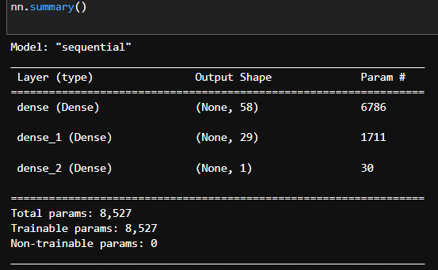
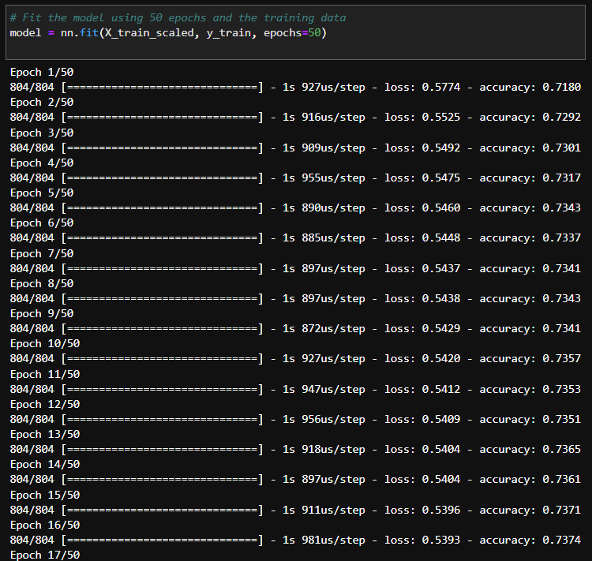
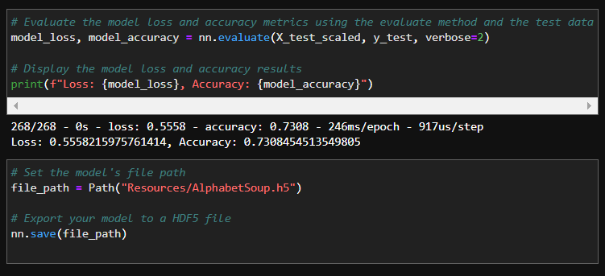

# Predicting_Startup_Success_Deep_Learning

This Jupyter notebook is meant to demonstrate how neural network models can be used to predict classification, and how alternative neural network models for the same data can be adjusted (based on the original model) in order to achieve higher accuracy, using data from a CSV file of a venture capital firm's history of more than 34,000 organizations that have received funding from them.
The notebook contains the whole process of model, fit, predict, evaluate for neural network models for both the original, and the alternatively constructed models. The alternative models differ from the original model in amount of hidden layers and activation functions used in different layers.

---

## Technologies

### Libraries:
* Pandas
* Path from pathlib
* TensorFlow (Which comes with Keras)
* Dense from tensorflow.keras.layers
* Sequential from tensorflow.keras.models
* train_test_split from sklearn.model_selection
* StandardScaler and OneHotEncoder from sklearn.preprocessing

The language of this notebook is Python on the Anaconda developement environment, worked upon on Jupyter Lab. The libraries used that come with Anaconda Python are Pandas, and sklearn. TensorFlow and it's features, Dense and Sequential, must be installed.

---

## Installation Guide

To install TensorFlow to your environment, while in dev mode, enter `pip install --upgrade tensorflow` to the terminal.
To confirm its installation, run `python -c "import tensorflow as tf;print(tf.__version__)"` after. As well, confirm the installation of Keras with the command `python -c "import tensorflow as tf;print(tf.keras.__version__)"`.

If ran correctly, just the `Version` of the package should print.

---

## Usage

#### Example of neural network summary:

#### Example of epoch iterations from the fitting of the original model:

#### Example of model evaluation of loss and accuracy:

All info is already input and worked on within the Jupyter file. Simply start from the top and go down the page to view relevant data, calculations, analysis, and notes.

---

## Contributor

Isaiah T Tensae